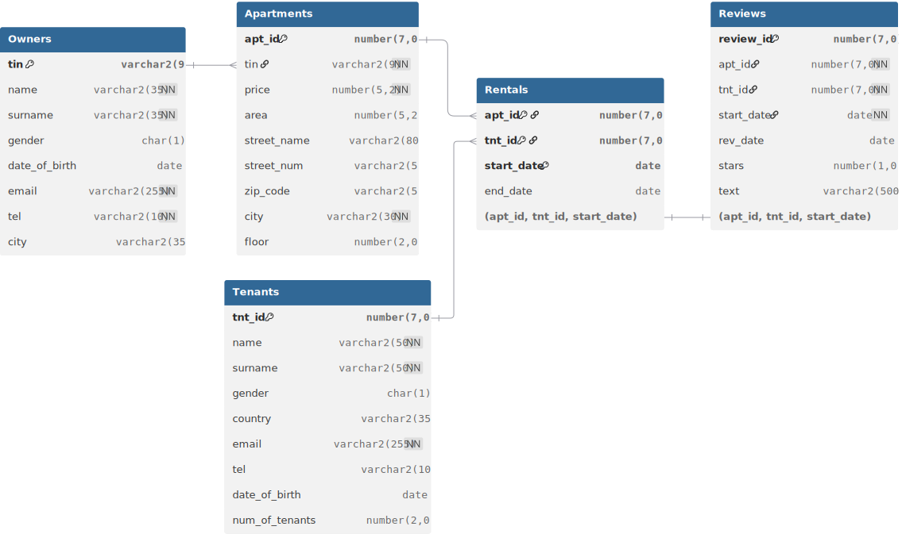

# Rental Property Management Database

This repository contains the design and testing of a relational database design for a rental property management scenario.
The goal was to design a clean, normalized schema and demonstrate how basic data engineering practices can make the model easier to maintain and analyze.

It is a project that demonstrates relational data modeling, data governance through database-level constraints and analytical querying to extract business intelligence.

## Key Architecture & Design Choices

This database was designed with a focus on data integrity and modularity. Key engineering decisions include:

* **Normalization (3NF):** The schema is normalized to eliminate data redundancy and ensure a single source of truth for dynamic entities (tenants, properties, rental agreements).
* **Data Governance:** Referential integrity (Foreign Keys) and column constraints (`CHECK`, `UNIQUE`, `NOT NULL`) were implemented at the database level to prevent malformed data from ever reaching the application layer.
* **Synthetic Data:** The `seed_data_dml.sql` script is intentionally populated with synthetic data designed to test constraints and business logic (e.g., overlapping dates, multiple rentals per tenant), rather than predictable scenarios.
* **Querying:** Analytical queries were constructed as a basis for Business Intelligence reporting. They require complex `JOIN`s for read-heavy operations like revenue tracking and occupancy rates.
* **Modular Script Architecture:** DDL, constraints, data seeding and analytical queries are isolated into distinct numbered scripts. This mimics CI/CD deployment and isolates logic for easier debugging.

## Repository Structure

The repository is organized into SQL scripts that were developed in a logical order:

- `src/01_schema_ddl.sql`: create tables and main schema definitions
- `src/02_constraints.sql`: add keys, indexes, integrity constraints
- `src/03_seed_data_dml.sql`: insert synthetic data for testing and exploration
- `src/04_analytical_queries.sql`: example queries for basic business reporting and testing integrity
- `src/99_teardown.sql`: cleanup script to drop tables when needed

Documentation and design artifacts are stored in `docs/`:

- `docs/schema_design.pdf`: explanation of entity relationships and design choices
- `docs/testing_validation.pdf`: summary of validation checks and outcomes
- `docs/ER_diagram.jpg`: entity-relationship diagram for the schema
